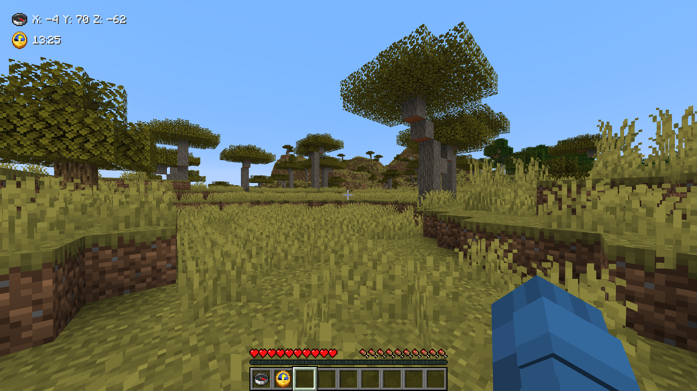

# Useful Compass

A Minecraft Fabric mod for version 26.1.2 which displays player coordinates and world time on the hud.
Requires the compass and the clock to be in your inventory respectively.

*Requires Fabric API to be installed!*

